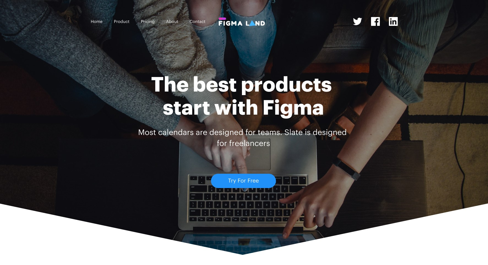

# Figma Land

A modern, responsive landing page built with Next.js and Tailwind CSS. This project showcases a professional landing page with multiple sections, animations, and interactive forms.



## 📋 Table of Content

- [Demo](#🚀-demo)
- [Features](#✨-features)
- [Technologies Used](#🛠️-technologies-used)
- [Installation](#💻-installation)
- [Contributing](#🤝-contributing)
- [License](#📄-license)

## 🚀 Demo

Live demo: [Figma Land](https://figma-land-lp.vercel.app/)

## ✨ Features

- **Modern Design** - Clean and professional UI based on Figma design
- **Fully Responsive** - Optimized for all device sizes (mobile, tablet, desktop)
- **Performance Focused** - Fast loading and smooth animations
- **Newsletter Subscription** - Mailchimp integration for email collection
- **Contact Form** - Web3Forms integration for contact form submissions
- **Animations** - Beautiful motion effects with Framer Motion
- **SEO Friendly** - Optimized metadata and semantic HTML
- **Server-Side API Routes** - Secure handling of form submissions

## 🛠️ Technologies Used

- **Framework**: [Next.js 15](https://nextjs.org/) with App Router
- **Styling**: [Tailwind CSS 4](https://tailwindcss.com/)
- **Animations**: [Motion](https://motion.dev/)
- **Icons**: [Font Awesome](https://fontawesome.com/)
- **Form Handling**:
  - [Mailchimp](https://mailchimp.com/) for newsletter subscriptions
  - [Web3Forms](https://web3forms.com/) for contact form
- **TypeScript**: Type-safe code

## 💻 Installation

### Prerequisites

- Node.js 18.0 or later
- npm or yarn

### Setup

1. Clone the repository:

   ```bash
   git clone https://github.com/yamami-mohammed-monsif/figma_land.git
   cd figma_land
   ```

2. Install dependencies:

   ```bash
   npm install
   # or
   yarn install
   ```

3. Create a `.env.local` file based on `.env.example`:

   ```bash
   cp .env.example .env.local
   ```

4. Add your API keys to the `.env.local` file:
   ```
   MAILCHIMP_API_KEY=your_mailchimp_api_key
   MAILCHIMP_SERVER_PREFIX=your_mailchimp_server_prefix
   MAILCHIMP_LIST_ID=your_mailchimp_list_id
   NEXT_PUBLIC_WEB3FORMS_KEY=your_web3forms_access_key
   ```

### Development

Run the development server:

```bash
npm run dev
# or
yarn dev
```

Open [http://localhost:3000](http://localhost:3000) in your browser.

### Production Build

Build for production:

```bash
npm run build
# or
yarn build
```

Start the production server:

```bash
npm run start
# or
yarn start
```

## 🤝 Contributing

Contributions are welcome! Please feel free to submit a Pull Request.

1. Fork the repository
2. Create your feature branch (`git checkout -b feature/amazing-feature`)
3. Commit your changes (`git commit -m 'Add some amazing feature'`)
4. Push to the branch (`git push origin feature/amazing-feature`)
5. Open a Pull Request

## 📄 License

This project is licensed under the MIT License - see the [LICENSE](/LICENCE.txt) file for details.
